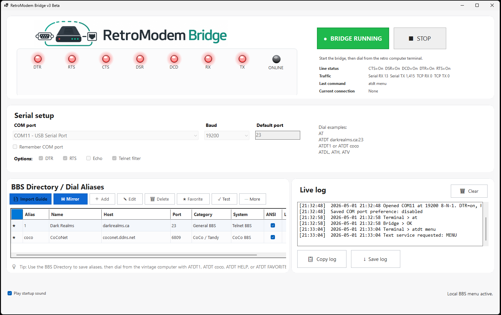
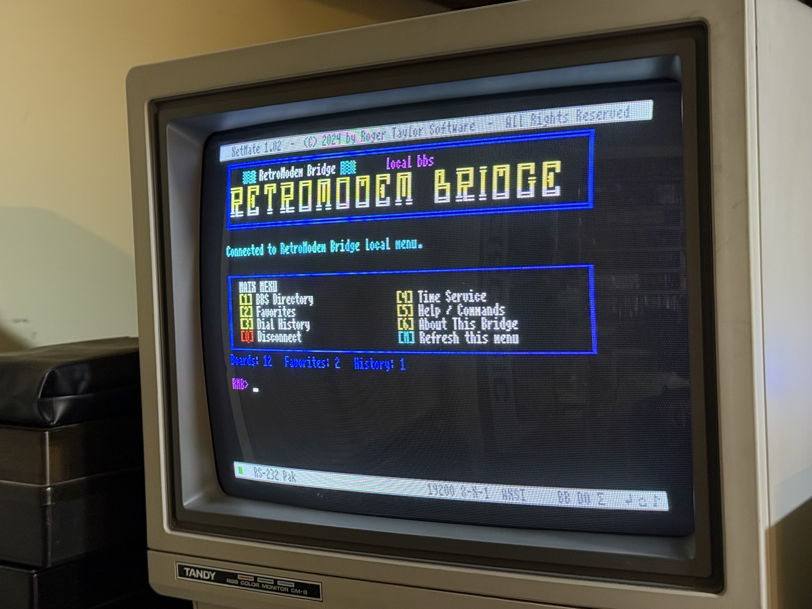
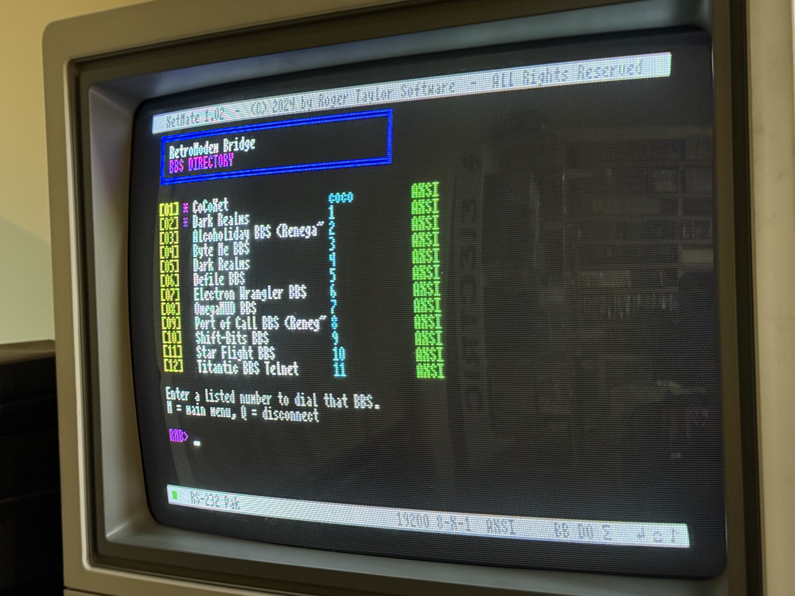
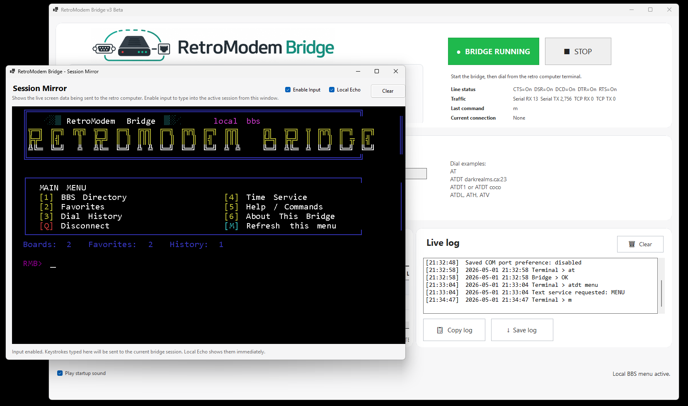
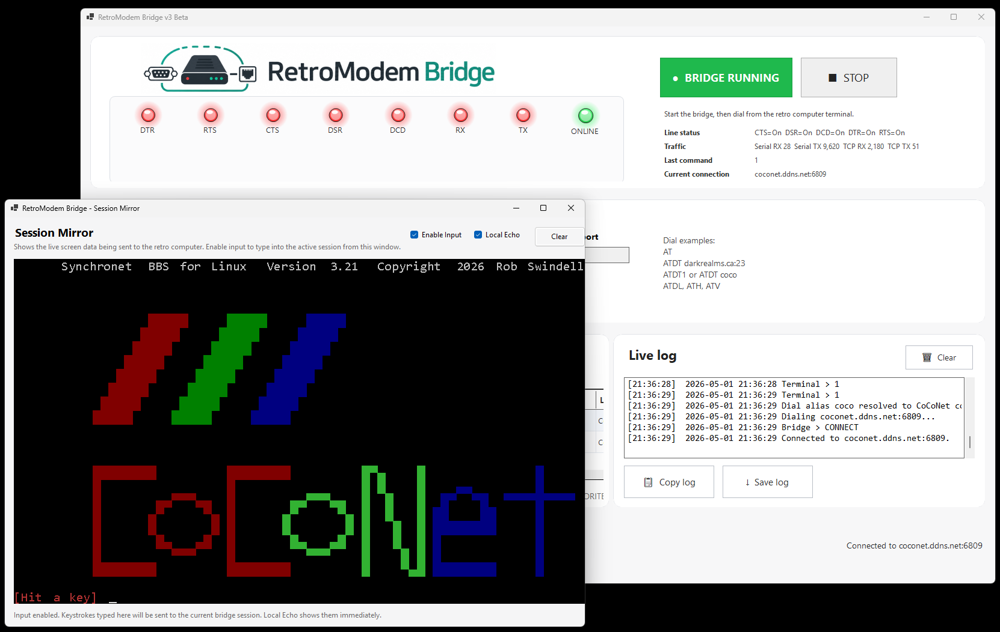

# RetroModem Bridge v3 Beta 2

RetroModem Bridge v3 Beta 2 adds a live Session Mirror, local BBS-style menu, favorites, dial history, connection testing, cleaner directory tools, and a new app icon.

## Screenshots

### RetroModem Bridge running



The main RetroModem Bridge window with the serial bridge controls, BBS directory, connection tools, modem lights, and live log.

### Local BBS menu on a CoCo 3



`ATDT MENU` opens a local BBS-style menu served by RetroModem Bridge and displayed on the CoCo 3.

### Local BBS directory listing on a CoCo 3



The local BBS directory lets you browse saved BBS entries directly from the retro terminal and dial a selected entry by number.

### Session Mirror



The Session Mirror shows what the retro computer is seeing from inside the Windows app. Input can be enabled so you can type into the active session from the PC.

### Session Mirror connected to a Telnet BBS



The Session Mirror can also be used while connected to a Telnet BBS, making it easier to test, troubleshoot, and capture screenshots.

## What's new

- **Session Mirror**
  - View what the retro computer is seeing from the Windows app
  - Optionally type into the active session from the app
  - Local Echo option so typed characters appear immediately

- **Local BBS menu**
  - `ATDT MENU` opens a BBS-style local menu
  - Directory, Favorites, History, Time, Help, and About screens
  - Dial BBS entries by number from the menu

- **BBS companion features**
  - Favorites
  - Dial history
  - Connection testing
  - Better directory fields
  - Local services like `ATDT HELP`, `ATDT TIME`, `ATDT BBSLIST`, and `ATDT FAVORITES`

- **Cleaner toolbar**
  - Import Guide and Mirror are easy to find
  - Less-used actions moved to More

- **New app icon**
  - New RMB modem/bridge icon included

## Test commands

```text
AT
ATDT HELP
ATDT TIME
ATDT MENU
ATDT BBSLIST
ATDT FAVORITES
```

## Notes

This is still a beta/pre-release. Please report issues with serial adapters, ANSI rendering, Session Mirror input, Telnet negotiation, and BBS compatibility.

If characters appear doubled in the Session Mirror, turn off **Local Echo**.
