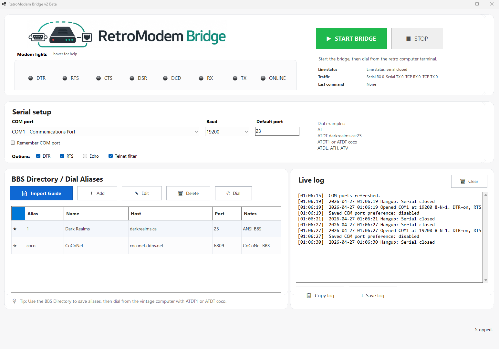

# RetroModem Bridge 2.0

RetroModem Bridge is a Windows serial-to-TCP modem bridge for vintage computers. It lets a retro computer use a serial connection to "dial" Telnet-accessible BBSes through a modern Windows PC.



## What it does

RetroModem Bridge acts like a simple modem-style bridge between a vintage computer and the internet.

You connect your retro computer to a Windows PC using a serial cable or USB-to-serial adapter. Then, from a terminal program on the retro computer, you can dial a BBS using commands like:

```text
ATDT darkrealms.ca:23
ATDT1
ATDT coco
```

RetroModem Bridge receives the AT command, opens a TCP connection from the Windows PC, and passes data back and forth between the BBS and your retro computer.

In simple terms, your Windows computer handles the modern internet connection, while your retro computer gets the experience of using a modem.

## Full feature overview

See the full feature list here:

[RetroModem Bridge 2.0 Features](RetroModemBridge-2.0-FEATURES.md)

## Designed for vintage computers

RetroModem Bridge was originally built and tested with a Tandy / TRS-80 Color Computer 3 using a Deluxe RS-232 Pak, but it can also work with other systems that support serial communication and terminal software.

Examples include:

```text
Tandy / TRS-80 Color Computer
Commodore
Apple II
Atari
Amiga
DOS PCs
Other serial-capable vintage computers
```

## Hardware I use

For my Tandy Color Computer 3 setup, I use a USB to DB25 RS-232 serial adapter connected to a Deluxe RS-232 Pak.

[USB to DB25 RS-232 Serial Adapter](https://amzn.to/4czD1Yg)

Disclosure: As an Amazon Associate, I may earn from qualifying purchases. Using this link does not increase the price you pay.

## Main features

RetroModem Bridge 2.0 includes:

```text
Modern Windows interface
Large Start Bridge and Stop controls
Slim modem light status strip
COM port and baud rate selection
Remember COM port option
BBS Directory / Dial Aliases
Telnet BBS Guide import
Live log with timestamps
Basic Hayes-style AT command support
Telnet filtering
Beginner-friendly tooltips for technical options
```

## BBS Directory / Dial Aliases

The BBS Directory works like a phone book.

Instead of typing a full BBS address every time, you can save BBS entries and dial them with short aliases.

Example:

```text
ATDT1
```

or:

```text
ATDT coco
```

Default entries include:

| Alias | Name | Host | Port | Notes |
|---|---|---|---:|---|
| 1 | Dark Realms | darkrealms.ca | 23 | ANSI BBS |
| coco | CoCoNet | coconet.ddns.net | 6809 | CoCoNet BBS |

## Modem lights

The modem light strip shows connection and serial activity.

| Light | Meaning |
|---|---|
| DTR | The vintage computer is ready |
| RTS | The vintage computer wants to send data |
| CTS | The serial adapter says it is okay to send |
| DSR | The serial device says it is ready |
| DCD | Carrier detected, usually meaning connected |
| RX | Data is being received |
| TX | Data is being sent |
| ONLINE | The bridge is connected to a BBS |

Hover over the light strip in the app for plain-English help.

## Recommended starting settings

| Setting | Recommended value |
|---|---|
| Baud | 19200 if supported |
| Data | 8-N-1 |
| Flow control | None |
| DTR | Enabled |
| RTS | Enabled |
| Echo | Disabled unless typed commands do not appear |
| Telnet filter | Enabled |
| Default TCP port | 23 |

## Basic use

1. Connect the vintage computer to the Windows PC using a serial connection.
2. Open RetroModem Bridge.
3. Select the correct COM port.
4. Select the baud rate.
5. Click **Start Bridge**.
6. Open a terminal program on the vintage computer.
7. Type `AT` and press Enter.
8. Confirm the bridge replies with `OK`.
9. Dial a BBS.

Examples:

```text
ATDT darkrealms.ca:23
ATDT1
ATDT coco
```

## Supported AT commands

```text
AT
ATI
AT&V
ATDT host:port
ATDT1
ATDT coco
ATDL
ATH
ATE0
ATE1
```

If no port is included, RetroModem Bridge uses the Default TCP port field.

Example:

```text
ATDT darkrealms.ca
```

With Default TCP port set to `23`, this connects to:

```text
darkrealms.ca:23
```

## Download

Download the latest Windows ZIP from the GitHub Releases page.

Extract the ZIP, then run:

```text
RetroModemBridge.exe
```

## Building in Visual Studio Code

To build from source, open the project folder in Visual Studio Code and run:

```powershell
dotnet restore
dotnet build
```

## Creating the Windows release ZIP

Run the publish script:

```powershell
.\publish-exe.ps1
```

The release output can then be zipped and uploaded to GitHub Releases.

## Requirements

To build:

```text
Windows
.NET 8 SDK
```

To run the published Windows build:

```text
Windows x64
A serial port or USB-to-serial adapter
A retro computer with serial terminal software
```

## Notes

RetroModem Bridge is not intended to be a full hardware modem emulator. It provides the core modem-style AT command behavior needed for many vintage terminal programs to connect to Telnet BBSes over TCP.
