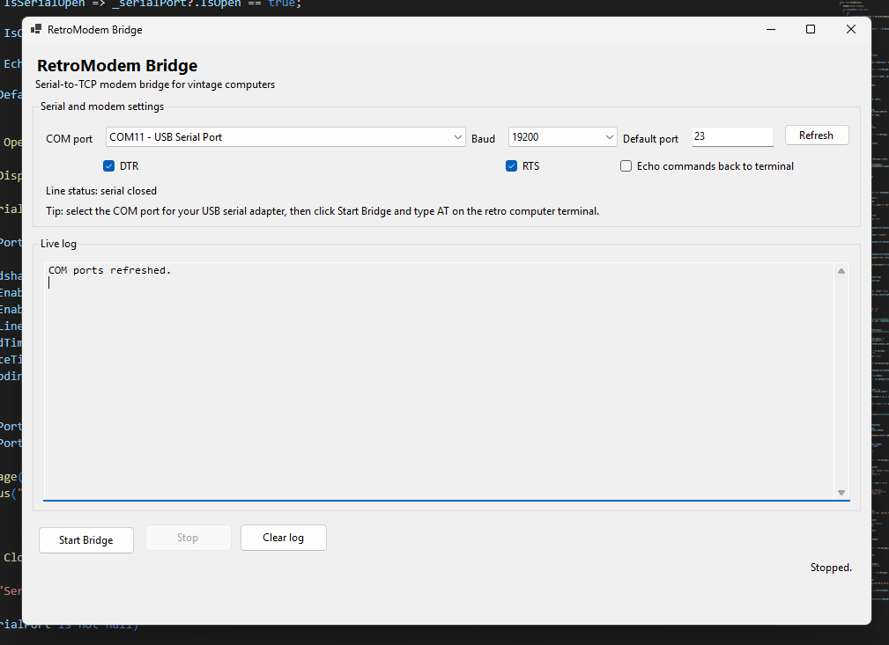
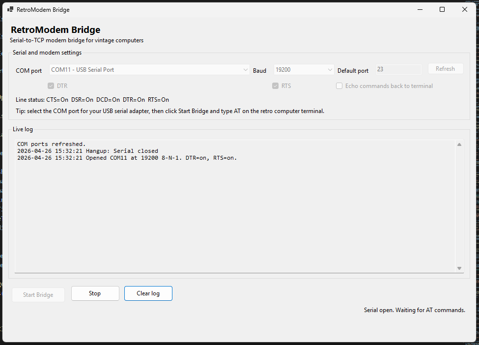
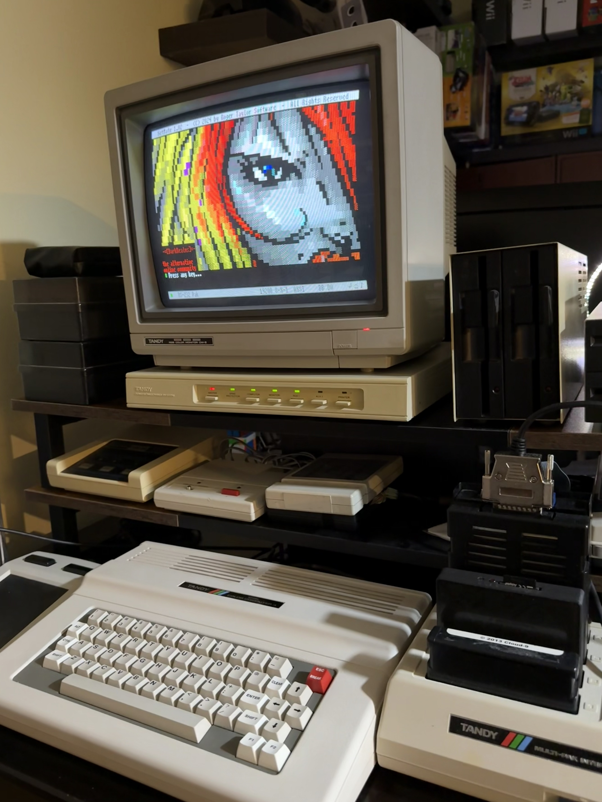

# RetroModem Bridge

RetroModem Bridge is a Windows serial-to-TCP modem bridge for vintage computers.

## Screenshots








It lets a retro computer with a serial terminal program dial Telnet BBSes using basic AT commands.

## What is included in this package

- Renamed from Coco Modem Bridge to RetroModem Bridge
- App title changed to RetroModem Bridge
- EXE name changed to RetroModemBridge.exe
- COM dropdown shows friendly USB serial names when Windows exposes them
- Refresh button for rescanning COM ports
- Live serial line status for CTS, DSR, DCD, DTR, and RTS
- One-click publish scripts for creating a self-contained Windows EXE

## Recommended starting settings

- Baud: 19200
- Data: 8-N-1
- Flow control: None
- DTR: On
- RTS: On
- Default TCP port: 23

## Choosing the right COM port

1. Open RetroModem Bridge.
2. Select the COM port for your USB serial adapter.
3. Select the baud rate you plan to use.
4. Click Start Bridge.
5. On the retro computer terminal, type:

```text
AT
```

The app should reply:

```text
OK
```

The COM dropdown may show friendly names like `COM11 - USB Serial Port (FTDI)` when Windows provides that information.

## Basic supported commands

```text
AT
ATZ
ATI
ATE0
ATE1
ATH
ATDT darkrealms.ca:23
ATDT bbs.fozztexx.com:23
```

If no port is included, the app uses the Default TCP port field.

Example:

```text
ATDT darkrealms.ca
```

with Default TCP port set to 23 will connect to:

```text
darkrealms.ca:23
```

## Building in Visual Studio Code

Open the RetroModemBridge folder in VS Code, then run:

```powershell
dotnet restore
dotnet build
dotnet run --project RetroModemBridge
```

## Creating the EXE

Double-click:

```text
publish-exe.bat
```

The finished EXE will be created here:

```text
RetroModemBridge\bin\Release\net8.0-windows\win-x64\publish\RetroModemBridge.exe
```

This publish script creates a self-contained Windows x64 EXE.

## Requirements

To build or publish:

- Windows
- .NET 8 SDK

To run the published self-contained EXE:

- Windows x64
- A serial port or USB-to-serial adapter
